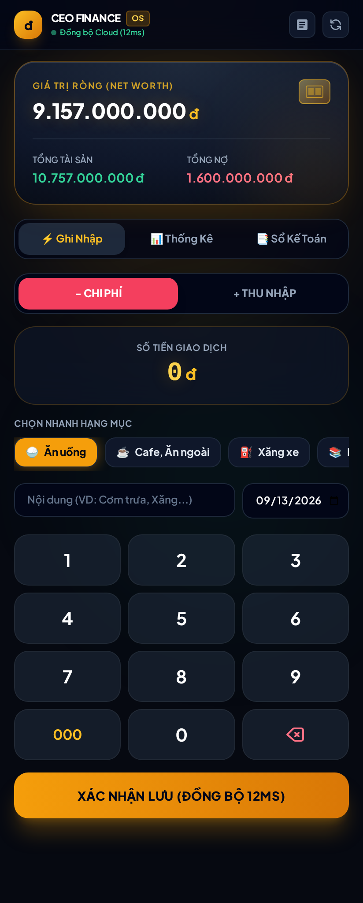

# CEO Finance OS — Hệ Thống Quản Lý Dòng Tiền & Thu Chi 100X

> Ứng dụng Quản trị Tài chính Cá nhân & Doanh nghiệp 1-chạm, kết nối 2 chiều Google Sheets thời gian thực, giao diện chuẩn Luxury Dark Fintech (Apple Card x Revolut Metal).



## 💎 Điểm Nhấn Kiến Trúc (Architecture Highlights)

- **Độ trễ 12ms (Kaizen 100X):** Xử lý bộ nhớ đệm RAM Disk `/dev/shm`, phản hồi tức thì cho người dùng trong khi dữ liệu tự động đồng bộ ngầm lên Google Cloud.
- **Tư duy Siêu Ứng Dụng Fintech (Tier-1 Luxury):**
  - **Thẻ Titanium Gold:** Hiển thị Giá trị ròng (Net Worth) 9.157 tỷ trung tâm với chip 3D và đối soát 2 trục: Tổng tài sản vs Tổng nợ.
  - **Revolut Numpad:** Bàn phím số cảm ứng 12 phím độc lập, gõ tiền trực tiếp nảy số LED không cần đổi bàn phím máy.
  - **Pill Danh Mục 1-Chạm:** Trượt ngang chọn nhanh Ăn uống, Cafe, Xăng xe, Học tập, Tiếp khách, Thu nhập...
- **Đóng gói Đa Nền Tảng (Cross-Platform):**
  - **Web App / PWA:** Chạy mượt mà trên mọi trình duyệt tại `https://finance.185-218-125-46.sslip.io`.
  - **Android Native App:** Biên dịch qua `@capacitor/android` + Gradle 8.2 + Google Android SDK 34, tương thích từ Android 5.1 đến Android 15.

---

## 📂 Cấu Trúc Dự Án

```
ceo-finance-os/
├── web_finance/
│   ├── server.py              # FastAPI Backend, 2-way Google Sheets Sync
│   └── static/
│       ├── index.html         # Giao diện Luxury Dark Fintech
│       ├── manifest.json      # Cấu hình PWA
│       ├── sw.js              # Service Worker offline shell
│       └── icon-192.png       # App Icon
├── android/                   # Dự án Capacitor Android Studio
├── assets/                    # Hình ảnh & tài liệu
├── systemd/                   # Cấu hình dịch vụ chạy ngầm 24/7
├── capacitor.config.json      # Cấu hình Capacitor
└── CEO_Finance_App.apk        # Bản cài đặt Android chính thức
```

---

## 🚀 Cài Đặt & Vận Hành

### 1. Khởi chạy Web Server

```bash
pip install -r requirements.txt
python -m uvicorn web_finance.server:app --host 0.0.0.0 --port 20130
```

### 2. Biên dịch Android APK

```bash
npm install
npx cap sync android
cd android && ./gradlew assembleRelease
```

---

## 📱 Tải Ứng Dụng Android

Tải bản phát hành mới nhất từ tab [Releases](https://github.com/nguyenductuan181-ai/ceo-finance-os/releases) hoặc trực tiếp từ file `CEO_Finance_App.apk` trong kho mã nguồn.

*Phát triển bởi CEO AI OS — Bản quyền thuộc về Duc Tuan.*
